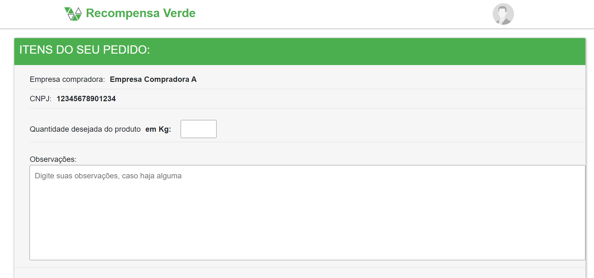
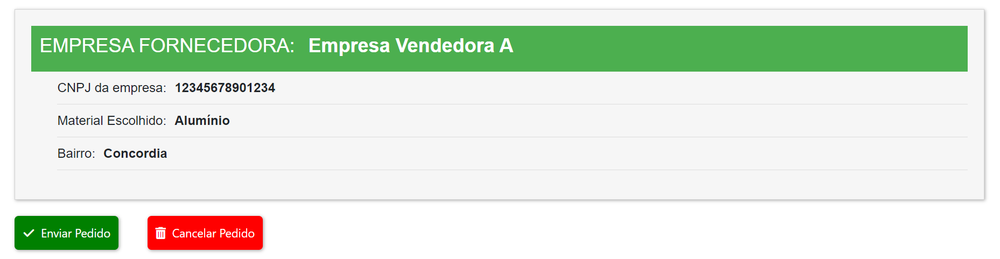

## 6. Interface do sistema

A interface do sistema foi projetada para garantir uma navegação intuitiva e eficiente, conectando os usuários de forma prática à proposta da plataforma. As principais telas incluem login, cadastro, gerenciamento de perfil e indicadores de impacto, todas com design responsivo e moderno. Cada elemento foi cuidadosamente pensado para proporcionar uma experiência agradável, promovendo engajamento e facilidade de uso.

## 6.1. Tela principal do sistema

A **Home Page** da plataforma **Recompensa Verde** foi projetada para oferecer uma experiência intuitiva e informativa, com foco na sustentabilidade e na economia circular. A página é organizada de forma clara e visualmente atraente, com os seguintes elementos:

### **Seção de Indicadores:**
- Apresenta dados em tempo real sobre o impacto da plataforma, incluindo estatísticas de reciclagem e taxa de entrega.

### **Seção "Sobre Nós":**
- Contém uma breve descrição da missão, visão e valores da Recompensa Verde.
- Destaque para a equipe por trás do projeto.
- Um botão redireciona para uma página detalhada sobre a plataforma.

### **Design Elegante e Responsivo:**
- Interface com design moderno e harmonioso.
- Uso de cores e elementos gráficos alinhados à identidade visual da plataforma.
- Responsividade para garantir uma navegação perfeita em diferentes dispositivos.

A **Home Page** não é apenas informativa, mas também cativa o usuário, conectando-o diretamente à proposta da Recompensa Verde.

### **Tela principal do sistema:**
  

## 6.2. Telas do processo 1

### **Tela de Login**
A tela de login da **Recompensa Verde** é projetada para oferecer praticidade e clareza, permitindo que usuários acessem a plataforma de forma rápida e intuitiva.

#### **Design Intuitivo:**
- Layout limpo e moderno, dividido em duas seções:
  - **Lado esquerdo:** Ilustração atrativa que reforça a identidade sustentável da plataforma.
  - **Lado direito:** Formulário de login.

#### **Formulário de Login:**
- **E-mail:** Campo para inserção do endereço eletrônico cadastrado.  
- **Senha:** Campo seguro para inserção da senha.  
- **Opções de Perfil:** Checkboxes para selecionar o tipo de usuário (Empresa Parceira ou Ponto de Coleta).  

#### **Botões e Links:**
- **Continuar:** Botão verde destacado para envio das credenciais.  
- **Esqueceu a Senha?:** Link para recuperação de acesso.  
- **Novo no site? Registre-se:** Link para criação de uma nova conta.

### **Tela da Atividade 1:**

---

### **Tela de Cadastro**
A tela de cadastro exibe uma interface organizada e atrativa:

#### **Lado esquerdo:**
- Ilustração de uma mulher interagindo com um formulário em um celular gigante, simbolizando segurança (ícone de cadeado) e preenchimento de dados.
- Predominância da cor verde, reforçando o tema ecológico.

#### **Lado direito:**
- Formulário de cadastro com os seguintes campos:
  - Nome, E-mail, CNPJ, Estado, Cidade, Bairro, Rua, Número, CEP, Senha e Confirmar Senha.
  - Opção de seleção do **Tipo de Cadastro.**
  - Botão verde rotulado como **"Continuar."**

#### **Modal de Seleção do Tipo de Empresa:**
- Complementa o cadastro solicitando ao usuário que escolha entre:
  - **Empresa Parceira:** Ilustração de prédios e explicação dos benefícios para compradores de materiais recicláveis.
  - **Ponto de Coleta:** Ilustração de uma garagem e explicação dos benefícios para vendedores de materiais recicláveis.
- Ambas as opções possuem design limpo com bordas verdes.

### **Tela da Atividade 2:**
  

---

### **Tela de Perfil do Usuário**
A tela de perfil exibe as informações do usuário e oferece opções de edição e exclusão.

#### **Campos exibidos:**
- Nome, E-mail, CNPJ, Estado, Cidade, Bairro, Rua, Número, CEP, Senha (ocultada) e Tipo (ex.: Compradora ou Ponto de Coleta).

#### **Botões disponíveis:**
- **Editar:** Abre o modal para modificar os dados do perfil.  
- **Apagar Perfil:** Exclui o perfil do sistema.

#### **Modal de Edição:**
- Design minimalista com campos organizados verticalmente.
- Campos editáveis: Nome, E-mail, CNPJ, Endereço completo, Senha e Confirmar Senha.
- Botões: **Salvar** e **Cancelar.**

### **Tela da Atividade 3:**
  

## 6.3. Telas do processo 2

O processo de Gerenciamento de Recicláveis envolve o fluxo completo de registro, atualização e exclusão de materiais recicláveis na plataforma. O ponto de coleta deve preencher um formulário de cadastro, informando o nome do material, o tipo de material e o preço por kg. Após a validação dos dados, o material é registrado no sistema e fica disponível para compra por empresas interessadas.

#### **Design Intuitivo:**
- Layout limpo e moderno, dividido em duas seções:
  - **Lado esquerdo:** Cadastro de Reciláveis
  - **Lado direito:** Recicláveis já cadastrados

#### **Formulário de Cadastro de Recicláveis:**
- **Nome:** Campo para inserção do nome do reciclável cadastrado.  
- **Descrição:** Campo inserir uma breve descrição sobre o reciclável.  
- **Preço por:** Informar o preço por kg do reciclável.  
- **Tipo de produto:** Campo para informar se o reciclável e Alumínio, Lixo eletrônico ou plástico. 

#### **Botões e Links:**
- **Cadastrar:** Botão verde destacado para o cadastro do reciclável.  
- **Cancelar:** Botão vermelho para cancelar o cadastramento do reciclável.  
- **Editar:** Botão azul em forma de lápis e papel, com a função de editar o reciclável já cadastrado.
 **Excluir:** botão vermelho em forma de lixeira, com a função de excluir os meterias cadastrados.  

### **Tela de Cadastro de Recicláveis**
A tela de cadastro de Recicláveis exibe uma interface organizada e atrativa:

#### **Lado esquerdo:**
- Formulário de cadastro com os seguintes campos:
  - Nome do produto, descrição, preço por kg e tipo de produto.
  - Opção para **Cadastrar** o cadastro.
  - Opção para **Cancelar** o cadastro.
- Predominância da cor verde, reforçando o tema ecológico.

#### **Lado direito:**
- Exibição dos produtos já cadastrados exibindo os itens:
  - Foto, Nome do produto, descrição preço por kg e tipo de produto.
- E possivel **Editar** e **Excluir** os produtos que foram cadastrados.

### **Tela da Atividade 1:**

---

### **Tela de Edição do Produto**
A tela pra editar o produto já cadastrado.

#### **Campos exibidos:**
- Nome do produto, descrição preço por kg e tipo de produto.

#### **Botões disponíveis:**
- **Cancelar:** Botão Cinza para cancelar a atualização do reciclável.  
- **Atualizar:** Botão azul, com a função de Atualizar o reciclável já cadastrado.

### **Tela da Atividade 2:**

---

### **Tela de Exlusão do Produto**
A tela pra Excluir o produto já cadastrado.

#### **Campos exibidos:**
- Mensagem de texto exibida para ter certeza de que a exclusão será realizada.

#### **Botões disponíveis:**
- **Cancelar:** Botão Cinza para cancelar a Exlusão do reciclável.  
- **Excluir:** Botão vermelho, com a função de Excluir o reciclável já cadastrado.

### **Tela da Atividade 3:**

## 6.4. Telas do processo 3

O processo de Solicitação de Pedido descreve a sequência de ações entre uma empresa compradora e uma empresa fornecedora de materiais recicláveis. O fluxo começa na seleção do material disponível, segue pela montagem e envio do pedido, recebimento do pedido, até a decisão de atendimento e ajuste, caso necessário.

#### **Design Intuitivo:**
- Layout limpo e moderno, dividido em duas seções:
  - **Lado esquerdo:** Filtro dos produtos recicláveis.
  - **Lado direito:** Recicláveis já cadastrados.

#### **Botões e Links:**
- **plástico:** Botão com o desenho de uma garrafa descrita como Plástico, usado para exibir somente os materiais do tipo Plástico.  
- **Lixo Eletrônico:** Botão com o desenho de um computador descrito como Lixo Eletrônico, usado para exibir somente os materiais do tipo Lixo Eletrônico.
- **Metal:** Botão com o desenho de círculos de metais descrita como Metal, usado para exibir somente os materiais do tipo Alumínio. 
- **Preço:** Botão com o desenho de um cartão de crédito descrito como Preço, usado para exibir os produtos com melhores preços no topo da lista.
 **Solicitar Pedido:** botão verde, com a função de direcionar para a área de solicitação.  

### **Tela de Exibição dos Recicláveis**
A tela de Solicitação de pedido exibe uma interface organizada e atrativa:

#### **Lado esquerdo:**
- filtro dos produtos com os seguintes campos:
  - Plástico, Lixo Eletrônico, Metal, Preço.

#### **Lado direito:**
- Exibição dos produtos já cadastrados exibindo os itens:
  - Foto, Nome do produto, descrição, preço por kg e tipo de produtos.
- Botão para **Solicitar Pedido** em cada um dos produto.

### **Tela da Atividade 1:**

---

### **Tela de Solicitação de Pedido**
A tela para solicitar um pedido de um determinado produto.

#### **Campos exibidos:**
- Nome da empresa compradora, CNPJ, Quantidade desejada do produto em kg, Observações,
CNPJ da empresa fornecedora, Material escolhido, Bairro.

#### **Botões disponíveis:**
- **Enviar Pedido:** Botão verde, com a função de enviar o pedido para análise da empresa vendedora.
- **Cancelar:** Botão vermelho para cancelar a solicitação do pedido.

### **Tela da Atividade 2:**

---

### **Tela de Solicitação do Pedido**
A tela exibindo as solicitações recebidas pela empresa vendedora.

#### **Campos exibidos:**
- Nome da empresa compradora, Tipo de Material, Quantidade requerida do produto em kg, Observações.

#### **Botões disponíveis:**
- **Negociar:** Botão verde, com a função de **Aceitar** o pedido solicitado.
- **Recusar:** Botão vermelho para **Recusar** a solicitação do pedido.  

### **Tela da Atividade 3:**

## 6.5. Telas do processo 4

_Descrição da tela relativa à atividade 1._

### **Tela da Atividade 1:**

_Descrição da tela relativa à atividade 2._

### **Tela da Atividade 2:**

## 6.6. Tela dos indicadores

_Descrição da tela relativa à atividade 1._

### **Tela da Atividade 1:**

---
