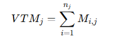

## 5. Indicadores de desempenho

| **Indicador**                 | **Objetivos**                                                                                       | **Descrição**                                                                                                                                                   | **Fonte de dados**                 | **Fórmula de cálculo**                                                                                       |
|-------------------------------|---------------------------------------------------------------------------------------------------|----------------------------------------------------------------------------------------------------------------------------------------------------------------|------------------------------------|-------------------------------------------------------------------------------------------------------------|
| **VOLUME DE MATERIAS RECICLADOS MENSALMENTE** | Avaliar a quantidade efetiva de resíduos recicláveis negociados e processados                       | Medir o volume de resíduos recicláveis negociados na plataforma e acompanhar o crescimento da reciclagem ao longo do tempo.                                    | Tabela solicitação de pedidos                 |    (VTMj) volume  total  reciclado do tipo  de material j  ( Mi,j ): volume do material do tipo j da  transação i ( i )   ( nj ): Número total de transação realizadas para o tipo  de material j da transação i |
| **CONTRIBUIÇÃO À RECICLAGEM EM BH**   | Avaliar o impacto do projeto na reciclagem dos resíduos recicláveis produzidos em Belo Horizonte          | Medir a porcentagem dos resíduos recicláveis de Belo Horizonte que são processados pelas empresas, promovendo sustentabilidade e reaproveitamento.                            | Dados públicos sobre produção de resíduos recicláveis em BH (SLU/Prefeitura de BH) e Tabela solicitação de pedidos             | (Quantidade reciclada pelas empresas / Quantidade total reciclável produzida em BH) * 100                                |
| **TAXA DE NEGOCIAÇÃO EFETIVADA (MÊS)**   | Manter controle sobre os materiais que estão sendo entregues                                     | Mede a porcentagem de pedidos de materiais recicláveis entregues em relação ao total de pedidos registrados, avaliando a eficiência das operações de entrega. | Tabela solicitação de pedidos | (número de pedidos entregues / número total de pedidos) * 100                                        |

