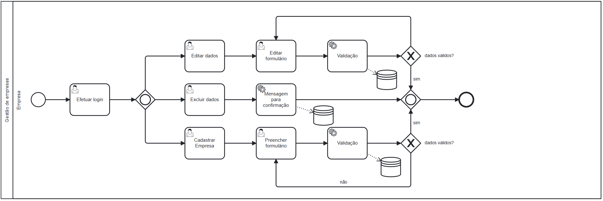

### 3.3.1 Processo 1 – Gestão de Empresas

---

### Descrição Geral

O processo de **Gestão de Empresas** envolve o fluxo completo de autenticação e registro de novos usuários no sistema. Ao acessar a plataforma, o cliente que tiver o primeiro contato com a plataforma terá que preencher uma ficha de cadastro, informando nome, CNPJ, CEP e telefone. Será feita uma validação dos dados e, logo após, ele irá se identificar como uma **Empresa Compradora** ou **Empresa Vendedora**. 

---

### Tipos de Dados Utilizados

Os seguintes tipos de dados serão aplicados nos campos do processo de cadastro:

- **Caixa de texto**: Campo de uma única linha de texto.
- **Número**: Campo para valores numéricos inteiros ou decimais.
- **Seleção única**: Campo com várias opções de valores mutuamente exclusivos (como **radio button** ou **combobox**).
- **Seleção múltipla**: Campo com várias opções que podem ser selecionadas simultaneamente (como **checkbox** ou **listbox**).
- **Caixa de senha**: Campo que oculta a entrada do usuário, utilizado para senhas.
- **Link**: Campo que direciona o usuário para uma nova página ou recurso, utilizado para navegação, como redirecionamentos ou chamadas para ações (ex: "Cadastre-se" ou "Esqueci minha senha").
  
---

### 1. **Login**

O cliente irá preencher os campos de **Email** e **Senha** para acessar a plataforma ou criar uma nova conta.

| **Campo**   | **Tipo**         | **Restrições**            | **Valor Padrão**  |
|-------------|------------------|---------------------------|-------------------|
| Email       | Caixa de Texto    | Formato de email válido    | ---               |
| Senha       | Caixa de Senha    | Mín. 8 caracteres         | ---               |
| Identificar papel   | Seleção única   | ---                       | ---               |

#### Comandos

| **Comandos**         | **Destino**                   | **Tipo**   |
|----------------------|-------------------------------|------------|
| Entrar               | Validação                     | default    |
| Esqueci minha senha  | Redefinição de Senha           | link       |
| Cadastre-se          | Formulário de Cadastro         | link       |

---

### 2. **Cadastro**

O cliente irá preencher os dados da sua empresa como **Nome**, **CNPJ**, **CEP** e **Endereço** para criar uma conta.

| **Campo**   | **Tipo**         | **Restrições**            | **Valor Padrão**  |
|-------------|------------------|---------------------------|-------------------|
| Nome        | Caixa de Texto    | ---                       | ---               |
| CNPJ        | Caixa de Texto    | 16 caracteres             | ---               |
| Cidade      | Caixa de Texto    | ---                       | ---               |
| Bairro      | Caixa de Texto    | ---                       | ---               |
| Número      | Caixa de Texto    | Apenas números            | ---               |
| CEP         | Caixa de Texto    | 8 caracteres              | ---               |
| Senha       | Caixa de Senha    | Mín. 8 caracteres         | ---               |
| Confirmar   | Caixa de Senha    | Mín. 8 caracteres         | ---               |

#### Comandos

| **Comandos**         | **Destino**                   | **Tipo**   |
|----------------------|-------------------------------|------------|
| Continuar            | Validação                     | default    |

---

### 3. **Identificar Papel**

Após preencher os dados, o cliente deverá se identificar como uma **Empresa Compradora** ou **Empresa Vendedora**.

| **Campo**           | **Tipo**        | **Restrições**            | **Valor Padrão**  |
|---------------------|-----------------|---------------------------|-------------------|
| Identificar papel   | Seleção única   | ---                       | ---               |

#### Comandos

| **Comandos**         | **Destino**                   | **Tipo**   |
|----------------------|-------------------------------|------------|
| Salvar            | Próxima etapa do cadastro      | default    |
| Fechar             | Retorna ao formulário anterior | default    |

---

### 4. **Edição de Perfil**

O cliente poderá editar os dados da sua empresa previamente cadastrados.

| **Campo**   | **Tipo**         | **Restrições**            | **Valor Padrão**    |
|-------------|------------------|---------------------------|---------------------|
| Nome        | Caixa de Texto    | ---                       | Valor atual         |
| CNPJ        | Caixa de Texto    | 16 caracteres             | Valor atual         |
| Cidade      | Caixa de Texto    | ---                       | Valor atual         |
| Bairro      | Caixa de Texto    | ---                       | Valor atual         |
| Número      | Caixa de Texto    | Apenas números            | Valor atual         |
| CEP         | Caixa de Texto    | 8 caracteres              | Valor atual         |
| Senha       | Caixa de Senha    | Mín. 8 caracteres         | Valor atual         |
| Confirmar       | Caixa de Senha    | Mín. 8 caracteres         | Valor atual         |

#### Comandos

| **Comandos**         | **Destino**                   | **Tipo**   |
|----------------------|-------------------------------|------------|
| Editar            | Abre um modal para edição      | default    |
| Apagar Perfil             | Deleta o perfil            | default    |

---

### 5. **Modal edição de Conta**

O cliente poderá editar os dados da sua empresa.

#### Comandos

| **Comandos**         | **Destino**                   | **Tipo**   |
|----------------------|-------------------------------|------------|
| Salvar              | Validação e Salvamento           | default    |
| Cancelar             | Retorna ao perfil              | default    |

#### Confirmação de Exclusão

Antes de excluir a conta, o sistema deve solicitar uma confirmação do cliente.

| **Comandos**         | **Destino**                   | **Tipo**   |
|----------------------|-------------------------------|------------|
| Ok  | Validação e Exclusão           | default    |
| Cancelar             | Retorna ao perfil              | default    |
