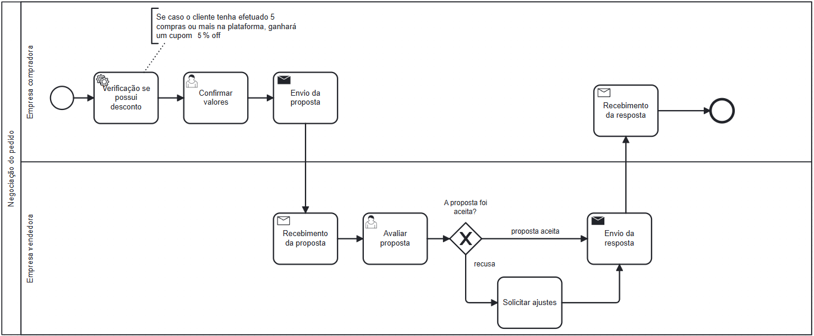

### 3.3.4 Processo 4 – Negociação do Pedido

### Descrição Geral

O processo de **Negociação do Pedido** envolve as interações entre a **Empresa Compradora** e a **Empresa Vendedora**, com o objetivo de ajustar os termos de uma proposta previamente discutida. Após o envio da proposta pela empresa compradora, a empresa vendedora avalia as condições apresentadas, incluindo o valor por kg, a quantidade desejada e quaisquer observações feitas pela compradora.

Se a empresa vendedora aceitar a proposta, o pedido é formalizado. No entanto, se ajustes forem necessários, a vendedora pode solicitar uma revisão do valor desejado por kg, além de informar seu nome e CNPJ. A negociação prossegue até que um consenso seja alcançado entre ambas as partes, podendo resultar na aceitação final da proposta ou na necessidade de novas interações.

Esse processo garante que as condições de venda sejam claras e aceitas por ambas as partes, promovendo eficiência e transparência nas transações comerciais.

---

### **Tipos de Dados Utilizados**

Os seguintes tipos de dados serão aplicados nos campos do processo de **Recebimento da Resposta**:

- **Caixa de Texto**: Campo de uma única linha de texto, usado para entradas curtas como o nome da empresa compradora ou vendedora, e CNPJ.
- **Área de Texto**: Campo de várias linhas, permitindo descrições detalhadas, como observações ou informações adicionais.
- **Número**: Campo para valores numéricos inteiros ou decimais, limitados a entradas positivas ou específicas, como quantidade desejada ou valor total.
- **Seleção Única**: Campo com várias opções, das quais somente uma pode ser selecionada, utilizado para decisões binárias, como aceitar ou recusar uma proposta.
- **Data**: Campo para seleção de uma data válida, utilizado para prazos ou registros de datas, com preenchimento automático pelo sistema para a data de recebimento.
- **Botão**: Elemento interativo usado para enviar formulários, confirmar decisões ou realizar uma ação dentro da interface, como "Confirmar Recebimento" ou "Cancelar".

---

### Detalhamento das Atividades

### **Verificação de Desconto**

| **Campo**              | **Tipo**         | **Restrições**                            | **Valor Padrão**            |
|------------------------|------------------|-------------------------------------------|-----------------------------|
| Número de Compras       | Número           | Verifica se o cliente tem 5 ou mais compras | ---                         |
| Desconto Aplicado?      | Seleção Única    | Sim ou Não (5% se tiver 5 ou mais compras) | Calculado automaticamente   |

#### Comandos

| **Comandos**           | **Destino**                       | **Tipo**   |
|------------------------|-----------------------------------|------------|
| Confirmar Desconto      | Aplica Desconto se Elegível       | botão      |
| Cancelar               | Cancela Operação                  | botão      |

---

### **Envio da Proposta**

| **Campo**              | **Tipo**         | **Restrições**               | **Valor Padrão** |
|------------------------|------------------|------------------------------|------------------|
| Nome da Empresa Compradora | Caixa de Texto   | Mínimo de 3 caracteres        | ---              |
| CNPJ                   | Caixa de Texto   | Formato válido de CNPJ        | ---              |
| Valor por kg           | Número           | Somente valores positivos     | ---              |
| Quantidade             | Número           | Somente valores positivos     | ---              |
| Valor Total            | Número           | Calculado automaticamente     | ---              |

#### Comandos

| **Comandos**           | **Destino**                       | **Tipo**   |
|------------------------|-----------------------------------|------------|
| Enviar Proposta         | Envia Proposta para a Empresa Vendedora | botão      |
| Cancelar               | Cancela Operação                  | botão      |

---

### **Recebimento e Avaliação**

| **Campo**              | **Tipo**         | **Restrições**               | **Valor Padrão** |
|------------------------|------------------|------------------------------|------------------|
| Nome da Empresa Compradora | Caixa de Texto   | Preenchido automaticamente    | ---              |
| Valor por kg           | Número           | Somente valores positivos     | ---              |
| Quantidade             | Número           | Somente valores positivos     | ---              |
| Valor Total            | Número           | Calculado automaticamente     | ---              |

#### Comandos

| **Comandos**           | **Destino**                       | **Tipo**   |
|------------------------|-----------------------------------|------------|
| Aceitar Proposta        | Aceita Proposta da Empresa Compradora | botão      |
| Solicitar Ajustes       | Solicita Ajuste da Proposta       | botão      |
| Cancelar               | Cancela Operação                  | botão      |

---

### **Solicitar Ajustes**

| **Campo**              | **Tipo**         | **Restrições**               | **Valor Padrão** |
|------------------------|------------------|------------------------------|------------------|
| Valor por kg           | Número           | Somente valores positivos     | ---              |
| Nome da Empresa Vendedora | Caixa de Texto   | Mínimo de 3 caracteres        | ---              |
| CNPJ                   | Caixa de Texto   | Formato válido de CNPJ        | ---              |
| Observação             | Área de Texto    | Opcional                      | ---              |

#### Comandos

| **Comandos**           | **Destino**                       | **Tipo**   |
|------------------------|-----------------------------------|------------|
| Enviar Ajuste           | Envia Ajuste de Proposta          | botão      |
| Cancelar               | Cancela Operação                  | botão      |

---

### **Envio da Proposta Ajustada**

| **Campo**              | **Tipo**         | **Restrições**               | **Valor Padrão** |
|------------------------|------------------|------------------------------|------------------|
| Resposta da Decisão     | Seleção Única    | Sim ou Não                    | ---              |
| Observação             | Área de Texto    | Opcional                      | ---              |
| Nome da Empresa Vendedora | Caixa de Texto   | Mínimo de 3 caracteres        | ---              |
| Valor Total            | Número           | Calculado automaticamente     | ---              |
| Quantidade             | Número           | Somente valores positivos     | ---              |

#### Comandos

| **Comandos**           | **Destino**                       | **Tipo**   |
|------------------------|-----------------------------------|------------|
| Enviar Resposta         | Envia Resposta da Proposta Ajustada | botão      |
| Cancelar               | Cancela Operação                  | botão      |

---

### **Recebimento da Resposta**

| **Campo**              | **Tipo**         | **Restrições**               | **Valor Padrão** |
|------------------------|------------------|------------------------------|------------------|
| Resposta da Decisão     | Seleção Única    | Sim ou Não                    | ---              |
| Observação             | Área de Texto    | Opcional                      | ---              |
| Nome da Empresa Vendedora | Caixa de Texto   | Preenchido automaticamente    | ---              |
| Valor Total            | Número           | Calculado automaticamente     | ---              |
| Quantidade             | Número           | Somente valores positivos     | ---              |
| Data de Recebimento    | Data             | Automática pelo sistema       | Data atual       |

