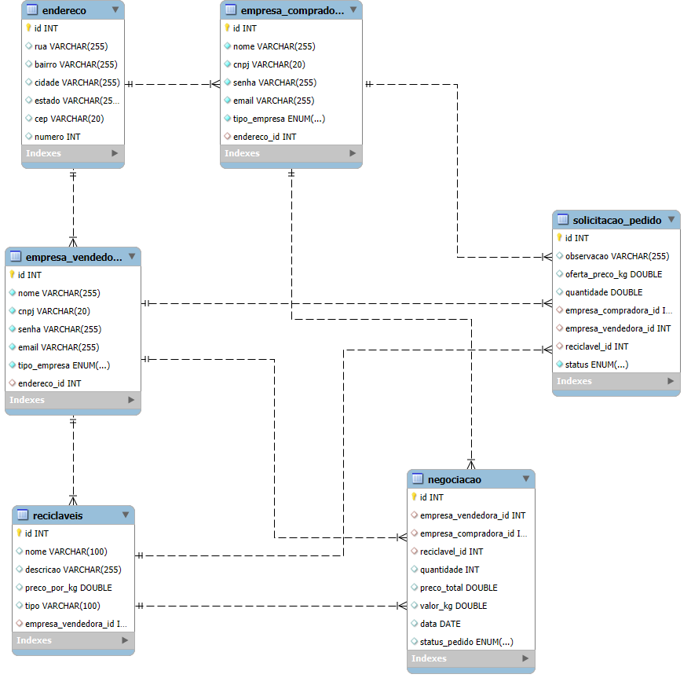

## 4. Projeto da solução

### 4.1. Modelo de dados

---

### 4.2. Tecnologias  

| **Dimensão**                            | **Tecnologia**                                                                                                                                                                                                                                                                               |  
|-----------------------------------------|-----------------------------------------------------------------------------------------------------------------------------------------------------------------------------------------------------------------------------------------------------------------------------------------------|  
| **SGBD (Sistema de Gerenciamento de Banco de Dados)** | **PostgreSQL**: O PostgreSQL, utilizado dentro da plataforma **Neon**, será empregado para armazenar e gerenciar dados da aplicação, como registros de empresas, materiais recicláveis disponíveis, preços negociados e pontos de coleta. Trata-se de um banco de dados relacional robusto e amplamente utilizado, adequado para a gestão de dados estruturados e não estruturados. |  
| **Front end**                           | **HTML + CSS + JavaScript**: Para a interface de usuário da plataforma, serão utilizadas as tecnologias padrão da web. HTML será utilizado para estruturar o conteúdo da plataforma, CSS para estilização e melhoria da experiência do usuário, e JavaScript para a interação e dinamismo da aplicação. |  
| **Back end**                            | **Java SpringBoot**: O SpringBoot será utilizado para o desenvolvimento do back end da aplicação, permitindo a criação de APIs RESTful para o gerenciamento de dados, autenticação de usuários e regras de negócio. O framework é robusto, escalável e oferece suporte a diversas integrações, facilitando o desenvolvimento de aplicações complexas. |  
| **Deploy**                              | **GitHub Pages**: O GitHub Pages será utilizado para hospedar a interface estática da aplicação (front end), facilitando o acesso pelos usuários. Além disso, o repositório no GitHub será utilizado para o controle de versão do projeto. |  
| **Ambiente de Desenvolvimento**         | **VS Code**: O Visual Studio Code será utilizado como a IDE para o desenvolvimento e depuração do código tanto no front end quanto no back end. A versatilidade da ferramenta e a ampla gama de extensões disponíveis a tornam ideal para o projeto. |  
| **Bibliotecas**                         | **JPA (Java Persistence API)**: Para o mapeamento objeto-relacional (ORM) no Spring Boot, permitindo a interação eficiente entre o back-end e o banco de dados PostgreSQL, facilitando a persistência de dados. **Bootstrap**: Framework front-end utilizado para criar interfaces responsivas e estilizadas de maneira simples e eficiente, fornecendo componentes prontos, como botões, formulários e barras de navegação. **Chart.js**: Biblioteca de JavaScript usada para a criação de gráficos interativos e dinâmicos, como gráficos de linhas, barras e pizza, que podem ser utilizados para a visualização de dados em tabelas ou dashboards. |  
